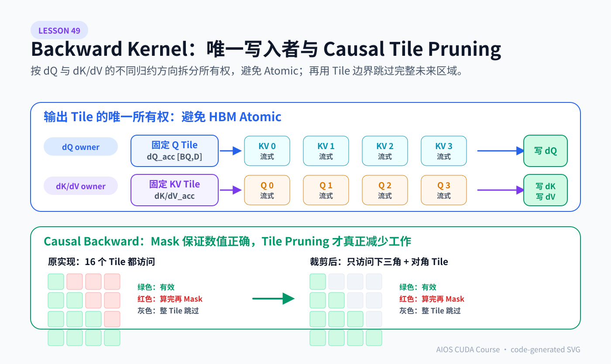
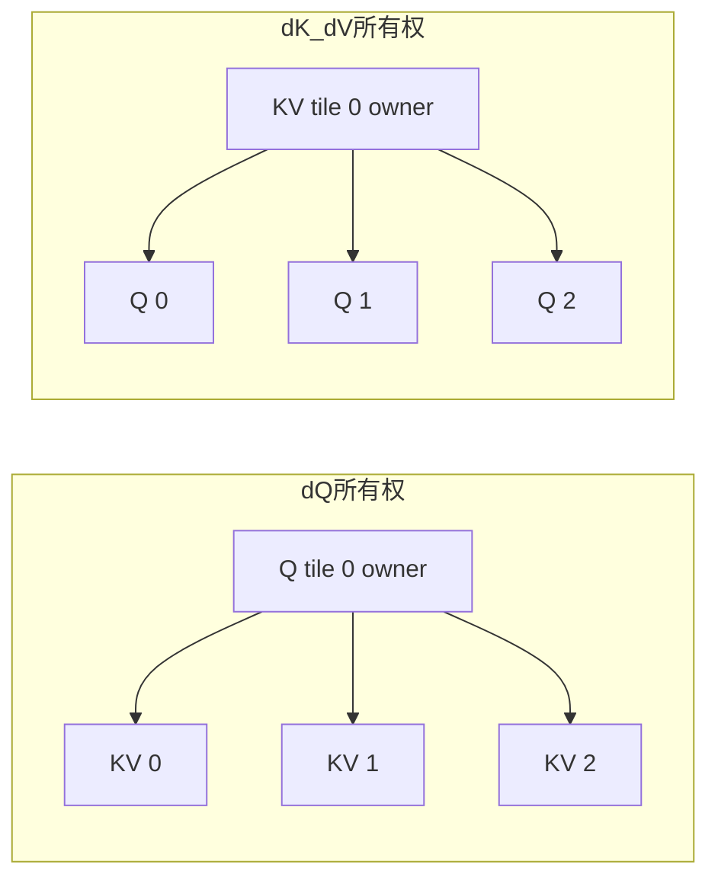
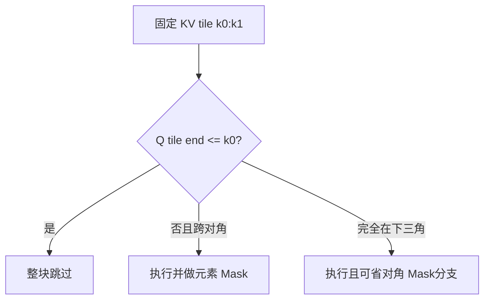

# Lesson 49：FlashAttention 反向 Kernel 源码带读——怎样让 `dQ`、`dK`、`dV` 各有唯一写入者，并裁掉 Causal 无效遍历

> 外部源码基线：[`hkproj/triton-flash-attention@296ee44`](https://github.com/hkproj/triton-flash-attention/tree/296ee44c8a238cd2192d13e22e9082251f1c1289)
>
> 核心文件：`triton/flash_attention.py` 中的 `_attn_bwd_preprocess`、`_attn_bwd_dq`、`_attn_bwd_dk_dv` 与 `TritonAttention.backward()`。
>
> 前置课程：Lesson 48 已推导 `D_i`、`dS`、`dQ`、`dK`、`dV`。本课只解决一个更工程化的问题：**这些公式怎样拆成互不竞争写 HBM 的 Triton Program？原实现为什么在 Causal Backward 中仍遍历整张方阵？怎样缩小循环边界而不漏掉任何有效梯度？**

> 边界说明：这里是对固定教学实现的源码带读和优化设计，不代表优化补丁已经合入上游，也不代表已经替换 AIOS 当前的 FlashInfer Attention 后端。



> 上半图说明为什么一个 Q Tile 独占 `dQ`、一个 KV Tile 独占 `dK/dV`，从而把归约留在 Program 内并避免最终 HBM Atomic；下半图区分“元素 Mask”与“整 Tile 跳过”。SVG 中的红、绿、灰区域对应后文调度集合实验。

## 1. 先看 Backward 的三次 Kernel Launch

上游 `TritonAttention.backward()` 的结构可压缩为：

```python
# 教学化摘录：名称与原实现对应，省略重复参数。
D = torch.empty_like(M)
_attn_bwd_preprocess[preprocess_grid](O, dO, D, ...)

_attn_bwd_dk_dv[grid](Q, K, V, dO, dK, dV, M, D, ...)
_attn_bwd_dq[grid](Q, K, V, dO, dQ, M, D, ...)
```

三次 Launch 分工明确：

| Kernel | 固定的输出 Tile | 内层遍历 | 最终写回 |
|---|---|---|---|
| `_attn_bwd_preprocess` | 一块 Query Row | Head Dimension | `D[i]` |
| `_attn_bwd_dq` | 一块 Query | 所有 K/V Tile | 对应的 `dQ` Tile |
| `_attn_bwd_dk_dv` | 一块 K/V | 所有 Query Tile | 对应的 `dK`、`dV` Tile |

这不是随便拆成三个函数。拆法直接决定是否需要 Atomic、片上累计器多大、哪一个输入 Tile可以常驻 SRAM，以及 Program 数量如何映射到 GPU。

## 2. 为什么先单独计算 `D`

Lesson 48 已得到：

```math
D_i=\sum_d dO_{i,d}O_{i,d}
```

以及：

```math
dS_{ij}=P_{ij}(dP_{ij}-D_i)
```

原实现的预处理 Kernel 每个 Program 读取同一块 `O` 与 `dO`：

```python
# 教学化核心代码
O_block = load(O[q_rows, :])
dO_block = load(dO[q_rows, :]).to(float32)
D_block = sum(dO_block * O_block, axis=1)
store(D[q_rows], D_block)
```

Shape：

```text
O_block   [BLOCK_SIZE_Q, HEAD_DIM]
dO_block  [BLOCK_SIZE_Q, HEAD_DIM]
D_block   [BLOCK_SIZE_Q]
```

把 `D` 先物化为 `[B,H,N]` 有两个作用：

1. `dQ` 与 `dK/dV` 两个 Kernel 都会用到它，避免在每个 Q×KV Tile 内重复归约 Head Dimension；
2. `D` 比完整 Probability Matrix 小得多，保存它仍符合 FlashAttention“少存大中间量、允许局部重算”的取舍。

以 `B=8,H=16,N=4096`、FP32 为例：

```math
8\times16\times4096\times4\text{ bytes}=2\text{ MiB}
```

而完整 `[B,H,N,N]` Probability Matrix 是 GiB 级。两者不是一个量级。

## 3. `dQ` Kernel：固定 Query Tile，扫描 K/V

对：

```math
dQ=dS K\cdot scale
```

一个 Query Row 的 `dQ` 需要汇总所有 Key 对它的贡献。因此最自然的所有权是：

```text
一个 Program 固定 q_start:q_end
→ Q、dO、M、D 这一块保持不动
→ K/V Pointer 沿序列向后移动
→ FP32 累计完整 dQ_block
→ 只写一次 dQ[q_start:q_end]
```

对应的教学化代码骨架：

```python
q_rows = q_start + arange(0, BLOCK_Q)
Q_block  = load(Q[q_rows, :])
dO_block = load(dO[q_rows, :])
M_block  = load(M[q_rows])[:, None]
D_block  = load(D[q_rows])

dQ_block = zeros([BLOCK_Q, HEAD_DIM], float32)

for k_start in range(0, SEQ_LEN, BLOCK_KV):
    K_T = load(K[k_start:k_start+BLOCK_KV, :].T)
    V_T = load(V[k_start:k_start+BLOCK_KV, :].T)

    S = scale * dot(Q_block, K_T)
    P = exp(S - M_block)
    P = apply_causal_mask_if_needed(P)

    dP = dot(dO_block, V_T)
    dS = P * (dP - D_block[:, None])
    dQ_block += scale * dot(dS, K_T.T)

store(dQ[q_rows, :], dQ_block)
```

关键 Shape：

```text
Q_block   [BQ, D]
K_T       [D, BKV]
V_T       [D, BKV]
S/P/dS    [BQ, BKV]
dQ_block  [BQ, D]
```

这条路径的核心不是“算一个小矩阵乘法”，而是把完整 K 维归约放在同一 Program 内。于是 `dQ_block` 在片上累计，HBM 中这一块 `dQ` 只有一个写入者。

## 4. `dK/dV` Kernel：固定 K/V Tile，扫描 Query

对：

```math
dV=P^T dO
```

```math
dK=dS^T Q\cdot scale
```

一个 Key Row 的 `dK` 与 `dV` 需要汇总所有 Query 对它的贡献。因此第二个 Kernel 采用相反方向：

```text
一个 Program 固定 k_start:k_end
→ K、V Tile 保持在 SRAM
→ Q、dO Pointer 沿 Query 轴移动
→ FP32 累计完整 dK_block / dV_block
→ 各写回一次
```

教学化代码骨架：

```python
kv_rows = k_start + arange(0, BLOCK_KV)
K_block = load(K[kv_rows, :])
V_block = load(V[kv_rows, :])

dK_block = zeros([BLOCK_KV, HEAD_DIM], float32)
dV_block = zeros([BLOCK_KV, HEAD_DIM], float32)

for q_start in range(0, SEQ_LEN, BLOCK_Q):
    Q_T      = load(Q[q_start:q_start+BLOCK_Q, :].T)
    dO_block = load(dO[q_start:q_start+BLOCK_Q, :])
    lse      = load(M[q_start:q_start+BLOCK_Q])

    S_T = scale * dot(K_block, Q_T)
    P_T = exp(S_T - lse[None, :])
    P_T = apply_causal_mask_if_needed(P_T)

    dV_block += dot(P_T, dO_block)
    dP_T = dot(V_block, dO_block.T)
    dS_T = P_T * (dP_T - D[q_start:q_end][None, :])
    dK_block += scale * dot(dS_T, Q_T.T)

store(dK[kv_rows, :], dK_block)
store(dV[kv_rows, :], dV_block)
```

关键 Shape：

```text
K_block / V_block  [BKV, D]
Q_T                 [D, BQ]
P_T / dS_T          [BKV, BQ]
dK_block / dV_block [BKV, D]
```

## 5. 两个 Kernel 为什么能避免 HBM Atomic

假设多个 Program 同时按 Score Tile `[BQ,BKV]` 工作：

```text
Program(q_tile=0, kv_tile=0) 产生一部分 dQ[0]
Program(q_tile=0, kv_tile=1) 也产生一部分 dQ[0]
```

它们若直接写同一块 `dQ`，就要：

- Atomic Add；或
- 先写临时 Tensor，再额外 Reduce；或
- 建立更复杂的 Cluster/协作机制。

上游选择“按输出归约维度包进一个 Program”：



结果是：

```text
每块 dQ 只有一个 Program 写
每块 dK/dV 只有一个 Program 写
```

因此不需要对最终 HBM 输出做 Atomic。代价是每个 Program 的内层循环较长，且需要足够大的 FP32 累计器。这是典型的“写入所有权换并行粒度”设计。

## 6. `BLOCK_SIZE_MICRO=32`、`BLOCK_SIZE_MACRO=128` 在做什么

固定实现的 Backward 配置是：

```python
BLOCK_SIZE_MICRO = 32
BLOCK_SIZE_MACRO = 128
NUM_WARPS = 4
NUM_STAGES = 3
```

调用映射：

| Kernel | 固定输出块 | 内层扫描块 |
|---|---:|---:|
| `dK/dV` | `BLOCK_KV=128` | `BLOCK_Q=32` |
| `dQ` | `BLOCK_Q=128` | `BLOCK_KV=32` |

直觉：固定并最终写回的 Tile 较大；内层流式载入的 Tile 较小。这样既增加输出累计器的工作量，也控制每轮临时 `P/dS` Tile 的大小。

但这些值不是数学常数，更不是所有 GPU、Dtype、Head Dimension 的最优值。它们只是该教学实现固定的一组配置。上游 README 也把“为 Backward 增加 Autotune”列为练习之一。

## 7. 原实现的 Causal Backward 为什么仍扫描完整序列

Causal Attention 只允许：

```math
k\le q
```

因此 Score 平面只有下三角有效：

```text
q=0  ■ · · ·
q=1  ■ ■ · ·
q=2  ■ ■ ■ ·
q=3  ■ ■ ■ ■
```

原实现的两个 Backward Kernel 都采用：

```python
for ... in range(SEQ_LEN // BLOCK):
    # 计算整块 S/P
    if causal:
        P = where(mask, P, 0)
```

这在数学上正确，但右上三角的许多 Tile 仍经历：

- K/V 或 Q/dO Load；
- `tl.dot` 计算 Score；
- `exp`；
- Mask；
- 后续乘加得到全零贡献。

Mask 只保证“错误元素不贡献”，并不自动让“整个无效 Tile 不执行”。

## 8. `dQ` 怎样安全裁掉未来 K/V Tile

固定一个 Query Tile：

```text
q ∈ [q0, q1)
```

其中最大的 Query Index 是 `q1-1`。任何：

```text
k >= q1
```

都对整块 Query 不可见。因此 `dQ` 的 K/V 扫描上界可以从：

```python
kv_hi = SEQ_LEN
```

缩为：

```python
kv_hi = min(SEQ_LEN, q_start + BLOCK_Q)
```

注意最后一个与对角线相交的 Tile 仍必须做逐元素 Mask，因为同一 Tile 中既有：

```text
k <= q 的有效位置
k > q 的无效位置
```

正确优化不是删掉 Mask，而是：

```text
先用 Tile 边界跳过整块未来区域
→ 对角 Tile 内继续逐元素 Mask
```

## 9. `dK/dV` 怎样安全跳过过早的 Query Tile

固定一个 K/V Tile：

```text
k ∈ [k0, k1)
```

对任意 `q < k0`，整块 Key 都在 Query 的未来，没有贡献。因此 Query 循环可以从包含 `k0` 的 Tile 开始：

```python
q_begin = floor(k_start / BLOCK_Q) * BLOCK_Q
```

而不是总从 0 开始。

同样，第一块与对角线相交，仍需逐元素 Mask；从后面的 Query Tile 开始，整块通常都在允许区域。



进一步优化可以把“跨对角 Tile”和“完整下三角 Tile”分成两个 Stage，类似 Forward 的左侧块与对角块。但先把循环起点裁掉，已经建立了正确的优化边界。

## 10. 小例子：16×16、Tile=4 到底省了什么

课程实验把 Score 平面建模为 `16×16`，Query/KV Tile 都是 4。

未优化：

```text
4 个 Query tiles × 4 个 KV tiles × 16 cells = 256 visited cells
```

Causal 有效元素数量：

```math
16\times17/2=136
```

按 Tile 边界裁剪后：

```text
dQ visited cells     = 160
dK/dV visited cells  = 160
```

其中 136 个是有效元素，剩余 24 个来自跨越对角线的 Tile，仍需元素级 Mask。

也就是说：

```text
256 → 160 visited cells
```

减少的是完整无效 Tile；不是把下三角内部的逐元素逻辑全部消掉。真实 Kernel 收益还会受到 Tile Shape、Head Dimension、Load、Tensor Core、Occupancy 和编译器调度影响，所以这个数字只能证明“遍历范围变小”，不能冒充真实 GPU 加速比。

## 11. 代码：课程中的调度模拟器

`run_lesson49.py` 不需要 GPU。它显式构造：

```python
def useful_causal(seq):
    return {(q, k) for q in range(seq) for k in range(seq) if k <= q}
```

然后分别比较：

```text
dQ baseline        vs dQ causal-pruned
dK/dV baseline     vs dK/dV causal-pruned
```

最重要的断言是：

```python
assert useful <= optimized_visited
```

这表示优化后的调度必须覆盖所有数学有效的 `(q,k)`，同时：

```python
assert len(optimized_visited) < len(baseline_visited)
```

只验证“工作集合缩小且没有漏算”。它不模拟 Triton 指令性能，也不宣称 GPU 时间按访问单元比例下降。

## 12. Backward Autotune 为什么比 Forward 更难验收

Forward 的 Autotune Key 在固定实现中是：

```python
key=["SEQ_LEN", "HEAD_DIM"]
```

Backward 若增加 Autotune，至少要考虑：

- `SEQ_LEN`；
- `HEAD_DIM`；
- Causal / Non-causal；
- Dtype；
- GPU 架构；
- `BLOCK_Q/BLOCK_KV`；
- `num_warps/num_stages`；
- 是否采用 Causal Tile Pruning。

还要注意 Triton Autotune 会为多个 Config 重复运行 Kernel。当前两个 Backward Kernel 都是“每个输出 Tile 唯一写入、最终覆盖写回”，所以重复试跑本身不依赖旧输出内容。但一旦改成：

```text
Atomic Add
in-place accumulation
读旧 dQ/dK/dV 再加
```

就必须为每个候选配置重置输出，否则 Autotune Benchmark 会把前一配置的结果残留带到后一配置，既污染正确性也污染性能。

生产服务还不能把首次编译和 Autotune 放进用户第一次按键延迟。应离线选常见 Shape，或启动时预热并缓存。

## 13. 固定源码还有哪些 Kernel 合同

这份代码适合作为学习材料，但调用前提较强：

```text
Q/K/V/O/dO stride 必须一致
SEQ_LEN 必须能被固定 Backward Tile 整除
Head Dimension 应落在实际验证集合
输入需要 CUDA、连续布局和匹配 Dtype
```

原 Backward：

```python
preprocess_grid = (SEQ_LEN // 128, BATCH_SIZE * NUM_HEADS)
grid = (SEQ_LEN // 128, 1, BATCH_SIZE * NUM_HEADS)
```

使用整数除法且没有尾块 Mask。若 `SEQ_LEN=192`，只会 Launch 一个 128-Token Macro Tile，剩余 64 个 Token 不会被完整处理。这不是浮点误差，而是调用合同被破坏。

因此优化 Backward 之前，先把 Shape Contract 写成测试和 Assert，比先调 `num_warps` 更重要。

## 14. 怎样判断该优化是不是值得做

正确顺序：

```text
固定正确性矩阵
→ Profile Causal Backward
→ 确认右上三角 Tile 仍消耗明显时间
→ 改循环起止边界
→ 再跑输出/梯度对照
→ 再测稳态时间、首次成本和峰值显存
```

Profiler 中重点看：

- 两个 Backward Kernel 各占总时间多少；
- Causal 与 Non-causal 的差异是否符合预期；
- DRAM Read/Write；
- Tensor Core / Math Pipe 活跃度；
- Warp Stall 原因；
- Register 与 Occupancy；
- 新分支是否导致严重发散；
- Kernel 数与 Launch Overhead 是否变化。

若训练 Shape 很小，裁掉一些 Tile 的收益可能被 Launch 与调度成本吞掉。若序列很长，理论上右上半区工作更多，才更值得优化。最终结论必须来自真实硬件 Benchmark，而不是只看循环少了一半。

## 15. 这套 Backward 与 AIOS 的关系

AIOS 当前核心任务是本地输入法推理，主要使用：

```text
Prefill Forward
Decode Forward
Paged KV Cache
CandidateGroup 多路候选
```

正常推理不执行 Attention Backward。因此 Lesson 48～49 的直接价值不是“让 AIOS 输入更快”，而是：

1. 训练或微调自定义模型时能看懂 FlashAttention 如何省中间显存；
2. 能读懂 Triton 中“固定输出 Tile、沿归约轴扫描”的所有权设计；
3. 能把相同思想迁移到 AIOS 自定义 Kernel：先定义唯一写入者，再决定是否需要 Atomic；
4. 能识别 Causal Mask 与 Causal Work Pruning 不是同一件事。

不要因为学会了 Backward Kernel，就把训练 Kernel 强行塞进 AIOS Serving Runtime。产品目标和工作负载优先。

## 16. 常见错误理解

### 错误 1：有 Causal Mask 就代表未来区域没有计算

不一定。原实现先计算整块 `QK` 与 `exp`，再把不允许位置置零。只有缩小循环边界或在编译期/运行期跳过整块 Tile，才真正减少那部分工作。

### 错误 2：`dQ`、`dK`、`dV` 应放进一个 Score-Tile Kernel 才算融合

若每个 Score Tile 独立 Program，会出现多个 Program 对同一 `dQ/dK/dV` Tile 的部分和竞争，可能需要 Atomic 或额外 Reduce。分成两个所有权方向可以避免最终输出 Atomic，未必比表面上的“一个 Kernel 全做”差。

### 错误 3：Causal Pruning 可以直接删除所有 Mask

边界 Tile同时含有效与无效元素，仍需元素级 Mask。只能跳过完全位于未来区域的 Tile。

### 错误 4：Autotune 只会计时，不会影响输出

Autotune 会重复运行多个 Config。若 Kernel 是有副作用的累加写，必须重置被修改的 Tensor。当前覆盖写回路径较安全，但改代码后要重新审计。

### 错误 5：CPU 调度实验显示访问减少 37.5%，GPU 就一定快 37.5%

GPU 时间还由矩阵指令效率、内存系统、Occupancy、分支、编译器、Launch 和时钟决定。CPU 实验只证明调度集合的逻辑变化。

## 17. 运行实验

```bash
python resources/lesson-49-triton-flash-attention-backward-kernels/run_lesson49.py
```

预期看到四组统计：

```text
dQ baseline: visited=256, productive=136, masked/waste=120
dQ causal-pruned: visited=160, productive=136, masked/waste=24
dK/dV baseline: visited=256, productive=136, masked/waste=120
dK/dV causal-pruned: visited=160, productive=136, masked/waste=24
PASSED
```

## 18. 练习题：检验问题与参考答案

### 问题 1：为什么 `_attn_bwd_dq` 固定 Query Tile，而不是固定 KV Tile？

**参考答案：** `dQ` 的每个 Query Row 需要汇总所有 Key 的贡献。固定 Query Tile并在一个 Program 内遍历完整 KV 轴，可以把 `dQ_block` 留在 FP32 片上累计器中，最终由唯一 Program 一次写回，避免多个 Program 对同一 `dQ` Tile 做 Atomic 或额外归约。

### 问题 2：为什么 `_attn_bwd_dk_dv` 可以同时计算 `dK` 与 `dV`？

**参考答案：** 两者都以固定 KV Tile为输出所有权，并沿 Query 轴归约；它们共享重算得到的 `P`、同一块 K/V、Q、dO、LSE 和 D。把 `dK/dV` 放在同一 Program 中可复用这些输入和中间量，同时每个 KV Tile仍只有一个写入者。

### 问题 3：对固定 Query Tile `[q0,q1)`，Causal `dQ` 的 KV 循环为什么最多到 `q1`？

**参考答案：** 该 Tile 中最大的 Query Index 是 `q1-1`。任何 `k>=q1` 都满足 `k>q`，对整个 Query Tile均为未来位置，Probability 和梯度贡献全为零，因此整个 KV Tile可跳过；与对角线相交的最后一块仍要元素 Mask。

### 问题 4：固定 KV Tile `[k0,k1)` 时，为什么 `dK/dV` 可以从包含 `k0` 的 Query Tile开始？

**参考答案：** 所有 `q<k0` 都早于该 Tile 中最小 Key，满足 `q<k`，整块均被 Causal Mask。把 Query 起点向前对齐到 `floor(k0/BQ)*BQ` 可保留跨对角 Tile，再由元素 Mask 处理边界，不会漏掉任何允许位置。

### 问题 5：为什么这两个 Kernel 不需要对最终 `dQ/dK/dV` 使用 Atomic？

**参考答案：** 调度为每个输出 Tile指定唯一 Program：一个 Q Tile owner 计算它的完整 `dQ`，一个 KV Tile owner 计算它的完整 `dK/dV`。归约在 Program 内完成，HBM 只发生最终覆盖写回，没有多个 Program 并发更新同一输出位置。

### 问题 6：给 Backward 加 Autotune 时，哪类改动会要求重置输出？

**参考答案：** 若 Kernel 从覆盖写改成读取旧输出后累加、Atomic Add、或写入共享临时 Buffer，Autotune 重复运行候选 Config 会保留前一次副作用，因此每次 Benchmark 前必须重置相关 Tensor。还要把首次编译/调优移出真实用户延迟。

## 19. 一句话复述

这份 Triton FlashAttention Backward 用“一个 Q Tile唯一拥有 `dQ`、一个 KV Tile唯一拥有 `dK/dV`”把完整归约留在 Program 内，从而避免最终输出 Atomic；Causal Mask 只保证数值为零，进一步按对角线收缩两个内层循环，才能跳过完整无效 Tile，同时保留边界 Tile 的元素级 Mask。

## 20. 一手参考与继续阅读

- 固定源码：`hkproj/triton-flash-attention@296ee44` 的 `triton/flash_attention.py`。
- FlashAttention：IO-Aware Exact Attention 与 Backward 重算思路。
- FlashAttention-2：改进并行划分与 Work Partitioning。
- Triton `autotune` / `Config` 官方 API 文档。
- 下一课：Lesson 50 将建立正确性矩阵、负向合同测试、显存预算、Benchmark 与 AIOS 集成边界。
