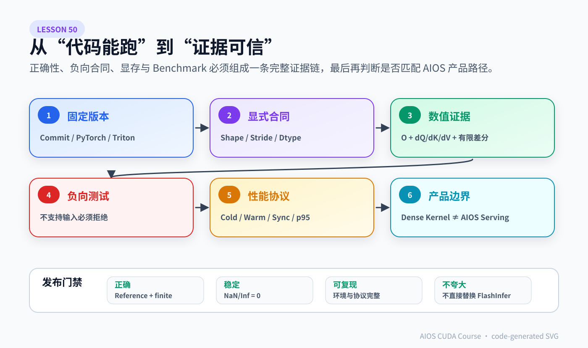

# Lesson 50：把 Triton FlashAttention 从“代码能跑”推进到“证据可信”——正确性矩阵、显存预算、Benchmark 与 AIOS 集成边界

> 外部源码基线：[`hkproj/triton-flash-attention@296ee44`](https://github.com/hkproj/triton-flash-attention/tree/296ee44c8a238cd2192d13e22e9082251f1c1289)
>
> 本专题收束课。前五课已经读完调用链、Forward、Grid/Layout/Causal Stage、Backward 数学和 Backward Kernel。本课不再添加算法，而是建立发布前最重要的能力：**怎样证明一个自定义 Attention Kernel 在声明的 Shape Contract 内正确、可复现、性能口径没有作弊，并且明确它与 AIOS 当前 Runtime 的边界。**

> 事实边界：课程固定分析的是一份教学实现。它不包含 AIOS 所需的完整 Varlen、Paged KV、GQA/MQA、单 Token Decode 和请求调度能力，因此本课程不会把“能计算连续 Dense Attention”包装成“已经可以替换 FlashInfer”。



> 这张代码生成 SVG 将发布证据压缩为六个连续门槛：固定版本、显式合同、数值证据、负向测试、性能协议、产品边界。任何一环缺失，都只能说明“某个例子跑过”，不能说明 Kernel 已经可以被可信地发布或接入 AIOS。

## 1. “PASSED” 只说明一个默认 Shape 通过，不能代表 Kernel 已完成

上游脚本默认执行：

```python
test_op(BATCH_SIZE=8, NUM_HEADS=16, SEQ_LEN=4096, HEAD_DIM=64, causal=True)
test_op(BATCH_SIZE=8, NUM_HEADS=16, SEQ_LEN=4096, HEAD_DIM=64, causal=False)
```

并比较：

```text
O
dQ
dK
dV
```

这比只测 Forward 好，但仍只覆盖：

```text
一个 Head Dimension
一个 Sequence Length
一种连续布局
一种输入 Dtype
两个 Causal Flag
一个随机分布
一个固定容差
```

Kernel 发布证据不能写成：

```text
默认脚本打印 PASSED
→ 所有 Shape、GPU、版本都正确
```

更诚实的结论是：

```text
在明确记录的环境和这一组输入下，Reference 与 Triton 输出落在给定误差范围内。
```

然后通过测试矩阵逐步扩大可声明范围。

## 2. 先把固定实现真正支持的合同写下来

从源码可以直接读出几个强前提。

### 2.1 Tensor Shape

```text
Q/K/V: [B, H, N, D]
O:     [B, H, N, D]
M/LSE: [B, H, N]
```

Self-Attention 下 Q/K/V 的 `N` 与 `D` 相同。代码没有 Cross-Attention 的独立 Query Length 与 KV Length 参数。

### 2.2 Layout

Forward 虽然分别接收 Q/K/V 的 stride 参数，但 Batch/Head Base Offset 使用 Q 的 Batch/Head Stride 计算，并复用于 K/V。Backward 还显式要求：

```python
Q.stride() == K.stride() == V.stride() == O.stride() == dO.stride()
```

因此教学实现的安全合同是：

```text
Q/K/V/O/dO 具有一致的连续布局和相同 Stride
```

不要把“函数签名接收不同 stride”误读成“任意布局已支持”。

### 2.3 Sequence Tile

Forward Autotune 候选含：

```text
BLOCK_SIZE_Q ∈ {64,128}
BLOCK_SIZE_KV ∈ {32,64}
```

Backward 固定：

```text
Macro Tile = 128
Micro Tile = 32
```

源码的 Load/Store 没有通用尾块 Mask，Backward Grid 使用整数除法：

```python
SEQ_LEN // 128
```

所以课程采用保守合同：

```text
N 能被 128 整除
```

它同时满足这些固定 Tile 的整除需求。若未来给 Forward/Backward 补齐 Boundary Check，才能扩大到任意 N。

### 2.4 Head Dimension

源码 Assert 只检查：

```python
BLOCK_SIZE_KV <= HEAD_DIM
```

这不等于任意 D 都经过验证。课程的基础验证集合限定：

```text
D ∈ {64,128}
```

是否支持 D=32、80、96、256，应以独立编译、数值和资源测试为准，不能从一个宽松 Assert 推断出来。

## 3. 建立最小正确性矩阵

建议先采用“小而覆盖关键分支”的矩阵：

| 维度 | 基础集合 | 目的 |
|---|---|---|
| Causal | `False, True` | 覆盖 Non-causal 和两阶段 Causal |
| N | `128, 256, 512, 1024` | 覆盖不同 Tile 数和 Autotune Key |
| D | `64, 128` | 覆盖常见 Head Dimension |
| B×H | `1×1, 1×8, 2×8` | 覆盖 Grid 第二维映射 |
| Dtype | FP16；可选 BF16 | 覆盖输入精度与编译路径 |
| Direction | Forward、Backward | 同时测 `O/dQ/dK/dV` |
| Values | 正态、小值、大值、重复值 | 覆盖稳定性和 Tie 情况 |

不是把所有笛卡尔积都跑一遍才算科学。可以分层：

```text
PR 快速矩阵：少量代表 Shape
Nightly 矩阵：扩大 N/D/B/H/Dtype
发布矩阵：固定硬件与版本，完整跑并归档结果
```

每条结果至少记录：

```text
max_abs_error
max_rel_error
NaN / Inf count
失败位置的 Shape、Causal、Dtype、Seed
```

## 4. Reference 应该怎样写

上游 Naive Reference 的数学路径是：

```python
S = Q @ K.transpose(-2, -1) * scale
if causal:
    S = mask_future_with_negative_infinity(S)
P = softmax(S.float(), dim=-1).half()
O = P @ V
```

Reference 的价值是“清晰、可信”，不要求快。需要注意：

1. Softmax 放到 FP32 是合理的稳定基线；
2. Reference 和 Triton 都使用同一 `dO`；
3. 每次比较前清空 `Q.grad/K.grad/V.grad`；
4. 不要让 Reference 调用另一条可能共享同一 bug 的自定义 Kernel；
5. 小 Shape 可再加纯 CPU 或高精度实现，降低 CUDA 库路径共因风险。

对当前固定实现，比较至少包含：

```python
torch.testing.assert_close(tri_O,  ref_O,  atol=..., rtol=...)
torch.testing.assert_close(tri_dQ, ref_dQ, atol=..., rtol=...)
torch.testing.assert_close(tri_dK, ref_dK, atol=..., rtol=...)
torch.testing.assert_close(tri_dV, ref_dV, atol=..., rtol=...)
```

同时显式检查：

```python
assert torch.isfinite(tri_O).all()
assert torch.isfinite(tri_dQ).all()
assert torch.isfinite(tri_dK).all()
assert torch.isfinite(tri_dV).all()
```

## 5. 容差不是随便填一个 `1e-2`

上游使用：

```text
rtol = 0
atol = 1e-2
```

这是特定实现和输入下的教学测试，不是通用标准。误差来源包括：

- FP16 输入；
- `P_block` 在 Dot 前转 FP16；
- FP32 `m/l/O_acc`；
- Tile 顺序改变浮点归约顺序；
- Reference Softmax FP32 后转 Half；
- 不同 GPU/编译器选择的低层指令。

合理做法：

```text
先收集误差分布
→ 按 Dtype 与 Shape 分桶
→ 设置足以容纳正常浮点差异、又能抓住逻辑错误的阈值
```

还要避免只看最大绝对误差。接近零的 Reference 值更适合绝对误差，较大值可结合相对误差。若梯度误差在某个特殊 Shape 突然放大，要先解释原因，而不是直接把容差加到能通过。

## 6. 用有限差分给 Backward 再加一层独立证据

Autograd Reference 和 Triton Backward 对照很重要，但都可能受到实现路径影响。对极小 Tensor，可以选若干输入元素做有限差分：

```math
\frac{\partial L}{\partial x}
\approx
\frac{L(x+\epsilon)-L(x-\epsilon)}{2\epsilon}
```

Lesson 48 的 CPU 实验已经对 Causal 与 Non-causal 的 `dQ/dK/dV` 做了这一验证。

有限差分不适合大规模 GPU 回归，因为：

```text
每个元素需要额外 Forward
成本很高
低精度下 epsilon 难选
```

它更适合：

- 数学推导完成后的极小例子；
- 定位某个梯度公式；
- 防止 Reference 与自定义 Backward 共享同一种推导错误。

## 7. 必须写“应该失败或跳过”的负向测试

成熟测试不仅证明支持什么，也证明不支持的输入不会静默给错结果。

针对固定实现，至少加入：

| 输入 | 预期 |
|---|---|
| `N=192` | 明确拒绝或 Skip，不得静默漏尾块 |
| `D=80` | 未验证时拒绝/Skip，而不是宣传支持 |
| Q/K/V Stride 不一致 | 明确 Assert 或转换为安全布局 |
| CPU Tensor | 明确设备错误 |
| Dtype 不一致 | 明确拒绝 |
| Q/K/V Shape 不一致 | 明确拒绝 |
| `dO` 非连续 | Backward 明确 Assert |

最危险的行为是：

```text
程序不报错
→ 只计算前 128 个 Token
→ 返回看起来 Shape 正确但内容不完整的 Tensor
```

所以 Shape Contract 失败必须尽早发生，优先在 Python Wrapper 层给出可读错误，而不是依赖 Kernel Undefined Behavior。

## 8. 原始默认测试为什么可能先被 Naive Reference 撑爆显存

完整 Probability Tensor 元素数量：

```math
B\times H\times N\times N
```

原始默认：

```math
8\times16\times4096\times4096
=2,147,483,648\text{ elements}
```

仅一个 Tensor：

```text
FP16: 4 GiB
FP32: 8 GiB
```

Reference 中还会同时出现 Score、FP32 Softmax、Half Probability、输出、梯度与 Autograd 保存项，所以真实峰值远高于单个 Tensor。

这解释了上游 README 的提醒：Naive 路径会物化 `N×N`，可能成为限制。正确的本地验证顺序应该是：

```text
1×2×128×64
→ 1×2×256×64
→ 逐步增大 N/B/H
→ 每一步记录 Peak Memory
```

不要一上来照抄 `8×16×4096×64`，然后把 OOM 误解成 Triton FlashAttention 本身不省显存。很可能是 Reference 先占满了显存。

## 9. 显存验证要分配给谁

至少分别记录：

```text
Reference Forward Peak
Triton Forward Peak
Reference Forward+Backward Peak
Triton Forward+Backward Peak
```

PyTorch 示例：

```python
torch.cuda.reset_peak_memory_stats()
# run one measured path
torch.cuda.synchronize()
peak_allocated = torch.cuda.max_memory_allocated()
peak_reserved = torch.cuda.max_memory_reserved()
```

解释时区分：

```text
allocated：活跃 Tensor 实际占用
reserved：Caching Allocator 向 CUDA 保留的内存池
nvidia-smi：进程上下文、库、Allocator Reserve 等整体视角
```

不要拿不同口径直接做百分比。也不要在同一进程先跑巨大 Reference、再跑 Triton，却不清理引用和缓存，然后把残留 Reserve 算到 Triton 头上。

## 10. Benchmark 必须把首次成本和稳态成本分开

Triton 首次遇到新 Shape 可能包含：

```text
Python Dispatch
JIT Compile
多个 Autotune Config 编译
每个 Config 的 Benchmark
缓存写入
```

这些成本和稳态 Kernel Runtime 是两类指标。

推荐至少报告：

| 指标 | 含义 |
|---|---|
| Cold first call | 新进程、新 Cache 下第一次调用 |
| Warm first shape | 已初始化环境、首次遇到新 Shape |
| Steady-state median | 充分 Warmup 后的典型 Kernel 时间 |
| p95/p99 | 重复运行的尾延迟 |
| Compile/autotune time | 独立记录首次准备成本 |

课程实验给出的阶段顺序是：

```text
compile/autotune outside user latency
→ warm up
→ synchronize
→ many measured repetitions
→ synchronize
→ report median/tail and full environment
```

## 11. 为什么 CUDA 计时必须同步

CUDA Launch 默认异步。错误写法：

```python
start = time.perf_counter()
run_kernel()
end = time.perf_counter()
```

这可能只测到 Python 发起 Launch 的时间。

更稳妥的墙钟写法：

```python
torch.cuda.synchronize()
start = time.perf_counter()
for _ in range(repeats):
    run_kernel()
torch.cuda.synchronize()
elapsed = time.perf_counter() - start
```

或使用 CUDA Event / `triton.testing.do_bench`。无论用什么工具，都要明确：

- 是否包含输出分配；
- 是否包含 Autograd Wrapper；
- 是否包含 Forward+Backward；
- 是否包含 Compile/Autotune；
- 是否复用输入；
- 是否同步；
- 重复次数和统计量。

## 12. 比较对象必须匹配工作负载

可以比较：

```text
Naive PyTorch Reference
PyTorch scaled_dot_product_attention
固定 Triton 教学实现
官方 Triton Fused Attention Tutorial 对应实现
其他已安装 Attention Backend
```

但比较时必须对齐：

```text
同一 B/H/N/D
同一 Dtype
同一 Causal Flag
同一 Forward 或 Forward+Backward
同一是否需要 Gradient
同一硬件/功耗/时钟条件
```

不要把：

```text
Triton Forward-only
```

与：

```text
PyTorch Forward+Backward
```

放进同一张速度表。也不要拿 Dense Training Attention 的吞吐直接推导 AIOS 单 Token Paged Decode 的延迟。

## 13. 性能报告至少写全这些元数据

可复现报告模板：

```text
GPU：型号、显存、功耗模式
Driver / CUDA Runtime
PyTorch / Triton 版本
Git Commit
B/H/N/D、Dtype、Causal
Forward 或 Forward+Backward
Warmup / Repeat 次数
是否启用 Autotune、Cache 状态
计时工具和同步方式
Median / p95 / Min
Peak allocated / reserved
正确性阈值与最大误差
```

上游固定 requirements 是：

```text
torch==2.4.0
triton==3.0.0
```

课程把它当成复现起点，而不是 2026 年所有环境的推荐版本。新版本 Triton 的 API、编译结果和性能可能变化，因此升级后必须重新跑正确性与 Benchmark，不能只改版本号。

## 14. Profiler 应回答什么，而不是只截一张图

Nsight Systems / Nsight Compute 或 PyTorch Profiler 的目标是解释：

```text
慢在哪里
为什么慢
改动后哪项证据发生变化
```

对 Forward：

- `_attn_fwd` 是否占主导；
- 不同 Autotune Config 的 Tile/Warp/Stage；
- Tensor Core 利用；
- DRAM 流量；
- Register/Shared Memory；
- Causal 两阶段是否产生额外成本。

对 Backward：

- preprocess、dQ、dK/dV 各占多少；
- Causal Pruning 后执行时间是否下降；
- 右上三角工作是否真的消失；
- Register 增加是否压低 Occupancy；
- 两个 Kernel 是否存在 Load 不平衡。

Profiler 结论示例应该是：

```text
在 N=4096,D=64,Causal=True 上，dQ Kernel 的 KV Loop 占主导；裁掉完整未来 Tile 后，DRAM Read 与 Tensor Core 指令减少，但 Register 不变，稳态中位时间下降 X%。
```

其中 `X%` 必须来自真实实验。没有数据时，只写“预计减少无效 Tile”，不要编造收益。

## 15. 固定实现距离生产 Attention Backend 还缺什么

| 能力 | 固定教学实现 | AIOS Serving 需要 |
|---|---|---|
| Dense Self-Attention | 有 | Prefill 中可能需要 |
| Causal | 有 | 需要 |
| Forward | 有 | 需要 |
| Backward | 有 | 纯推理主路径不需要 |
| Varlen Batch | 无 | 多请求 Prefill 需要 |
| Paged KV | 无 | AIOS 核心需要 |
| GQA/MQA Head Mapping | 无 | 取决于模型，通常需要 |
| Query Length = 1 Decode | 无专项设计 | AIOS 高频路径 |
| KV Page Table | 无 | 需要 |
| Latest-wins / Cancel | 无 | AIOS 请求层需要 |
| CandidateGroup | 无 | AIOS 产品合同需要 |
| 通用尾块 | 无 | 生产 Shape 应明确支持 |
| 完整错误处理 | 很少 | 需要 |
| 多版本 CI/Benchmark | 无 | 发布需要 |

这张表非常关键：它把“Attention 数学 Kernel”和“LLM Serving Runtime”分开了。

## 16. 为什么不能直接替换 AIOS 的 FlashInfer

AIOS 当前不是只调用：

```text
O = softmax(QK^T)V
```

它还要处理：

```text
Request → Scheduler → Varlen Metadata
→ Page Table / KV Cache
→ Prefill 或 Decode Wrapper
→ GQA Head 映射
→ 输出回到 Model Forward
```

FlashInfer 提供的是面向 Serving 的 Wrapper 与 Kernel 组合。固定 Triton 教学实现只接连续 `[B,H,N,D]` Tensor。

直接替换会丢失：

- 不同请求长度；
- 非连续 KV Page；
- Decode 每请求一行 Query；
- AIOS 的 Cache 所有权；
- 当前已验证的 Backend Contract。

正确姿势是：

```text
把课程当作底层机制实验
→ 只在一个隔离 Benchmark / Feature Flag 下探索连续 Prefill
→ 若真要接入，再逐项设计 Varlen、Paged、GQA、Decode Contract
→ 与 FlashInfer 做端到端正确性和完整请求延迟对照
```

## 17. 这份源码最适合作为哪三个实战项目

### 项目 A：Backward Autotune

目标：

```text
为 dQ 与 dK/dV 建立有限 Config 集
→ 用 N/D/Causal 作为受控 Key
→ 检查 Autotune 副作用
→ 保存每个 Shape 的胜出配置与首次成本
```

验收：输出/梯度不变，固定硬件上有可复现稳态收益，首次调优不进入服务 p95。

### 项目 B：Causal Backward Tile Pruning

目标：按 Lesson 49 的循环边界减少完整未来 Tile，同时保留对角 Tile Mask。

验收：

```text
所有原正确性矩阵通过
有限差分小例子通过
Profiler 证明无效 Tile 工作减少
长序列 Causal Backward 稳态时间改善
Non-causal 路径不回退
```

### 项目 C：把隐式合同变成显式 Wrapper

目标：在 Launch 前验证：

```text
Device / Dtype / Shape / Stride / N Tile / D Set
```

验收：所有负向案例给出清晰错误，不再静默漏算尾块。

这三个项目比“随便再调一个 BLOCK_SIZE”更完整，因为它们同时覆盖算法、Kernel、测试与工程边界。

## 18. 一个可发布的验收清单

### 正确性

- [ ] Forward 与可信 Reference 对齐；
- [ ] `dQ/dK/dV` 全部对齐；
- [ ] Causal/Non-causal 都覆盖；
- [ ] 多个 N/D/B/H/Dtype；
- [ ] NaN/Inf 检查；
- [ ] 固定 Seed 可复现；
- [ ] 小例子有限差分通过。

### 合同

- [ ] Shape/Stride/Dtype/Device Assert；
- [ ] 非整除 N 明确拒绝或正确处理；
- [ ] 未验证 D 不宣传；
- [ ] 非连续 Tensor 行为明确；
- [ ] 支持与不支持能力写进 README。

### 性能

- [ ] Cold 与 Steady-state 分开；
- [ ] Warmup 和 Synchronize 正确；
- [ ] 记录中位数与尾延迟；
- [ ] 记录 Peak allocated/reserved；
- [ ] 同一硬件、Shape、Dtype、Direction；
- [ ] Profiler 能解释收益；
- [ ] 不用 CPU 机制实验冒充 GPU Benchmark。

### 产品边界

- [ ] 不宣称已替换 FlashInfer；
- [ ] 不把 Training Backward 收益等同于输入法 Decode 收益；
- [ ] 若接 AIOS，使用隔离 Backend/Feature Flag；
- [ ] 端到端测完整请求，而非只报 Kernel 微基准。

## 19. 代码：课程验证矩阵脚本

`run_lesson50.py` 用纯 Python 固化两类知识：

1. 哪些 Shape 满足当前保守合同；
2. Benchmark 的阶段顺序。

核心合同：

```python
def satisfies_pinned_kernel_contract(case):
    if case.seq % 128:
        reject("N not divisible by backward macro tile")
    if case.seq % 64:
        reject("N not divisible by forward candidate tiles")
    if case.dim not in (64, 128):
        reject("D outside teaching/tested set")
```

它不是声称“源码只可能支持 64/128”，而是把课程当前有证据的范围与猜测分开。未来新增 GPU 测试并通过后，可以有证据地扩大集合。

脚本还计算 Naive FP32 Probability 的内存：

```python
B * H * N * N * 4
```

并断言原默认 Shape 的单个 FP32 `P` 正好是 8 GiB，提醒学习者先缩小 Reference 测试。

## 20. 运行实验

```bash
python resources/lesson-50-triton-flash-attention-validation/run_lesson50.py
```

输出将包含：

```text
四个合同内案例：PASS
N=192：SKIP
D=80：SKIP
原默认 FP32 P：8.00 GiB
Benchmark 六阶段协议
PASSED
```

这是 CPU 合同实验，不执行 Triton，也不产生 GPU 性能结论。

## 21. 常见错误理解

### 错误 1：默认脚本通过，就说明 Kernel 支持任意 Sequence Length

错。固定实现缺少通用尾块处理，Backward 使用 `N//128`。未整除 Shape 可能静默漏算，必须拒绝或实现边界 Mask。

### 错误 2：FlashAttention 省显存，所以默认测试一定不会 OOM

Triton 路径可能省显存，但 Naive Reference 会物化巨大 `[B,H,N,N]`。默认 Shape 的单个 FP32 Probability 已是 8 GiB，Reference 的真实峰值更高。

### 错误 3：第一次调用慢，说明 Kernel 稳态慢

第一次可能包含 JIT Compile 和 Autotune。必须分别报告 Cold、首次新 Shape 和 Warm Steady-state。

### 错误 4：Kernel 微基准比 FlashInfer 快，就能替换 AIOS Backend

Dense 连续 Attention 微基准没有覆盖 Varlen、Paged KV、GQA、Decode、Scheduler 和 Cache 生命周期。必须先补齐能力，再做完整请求对照。

### 错误 5：把容差放宽到测试通过就是解决正确性问题

容差需要来自 Dtype/Shape 的误差分布。异常 Shape 的大误差可能是 Mask、Stride、尾块或梯度公式错误，不能用无限放宽掩盖。

### 错误 6：只要输出正确，性能报告可以不写环境

不同 GPU、Driver、PyTorch、Triton、功耗和 Cache 状态都会改变结果。没有环境与协议，数字不可复现，也无法判断首次成本是否被隐藏。

## 22. 练习题：检验问题与参考答案

### 问题 1：为什么课程把 `N%128==0` 作为保守合同？

**参考答案：** Backward 的 Macro Tile固定为 128，Grid 使用 `N//128`，且 Load/Store 没有尾块 Mask。若 N 不整除，剩余 Token 可能不被处理。以 128 整除作为课程合同可以避免静默漏算；未来只有补齐边界处理和测试后才能扩大范围。

### 问题 2：原始 `B=8,H=16,N=4096` 的 Naive FP32 Probability 为什么是 8 GiB？

**参考答案：** 元素数为 `8×16×4096×4096=2,147,483,648`，FP32 每元素 4 Byte，总计 `8,589,934,592 Byte=8 GiB`。这还不包括 Score、Half Probability、输出、梯度和 Autograd 保存项。

### 问题 3：正确的 Triton Benchmark 为什么要在计时前后同步？

**参考答案：** CUDA Launch 异步；没有同步时，CPU 墙钟可能只测到提交 Kernel 的时间。计时前同步清空之前工作，计时后同步等待被测 Kernel 完成，才能把实际设备执行纳入时间。

### 问题 4：为什么 Cold First Call 与 Steady-state 必须分开报告？

**参考答案：** Cold 路径可能包含 Triton JIT Compile、多个 Autotune Config 的编译与试跑、Cache 初始化；稳态只执行已缓存的胜出 Kernel。两者对应部署准备成本与真实重复调用成本，混在一起会误导延迟判断。

### 问题 5：为什么这份 Dense Triton 实现不能直接替换 AIOS 的 FlashInfer？

**参考答案：** 它只接受连续 `[B,H,N,D]` Dense Self-Attention，没有 AIOS 所需的 Varlen Batch、Paged KV、Page Table、GQA/MQA 映射、Query Length=1 Decode 和 Serving Wrapper。数学算子相同不代表 Runtime Contract 相同。

### 问题 6：发布前为什么要有“应该失败”的测试？

**参考答案：** 不支持的 Shape/Layout 若静默运行，可能返回 Shape 正确但内容缺失的结果，最难发现。负向测试把支持边界变成可执行合同，确保非整除 N、Stride 不一致、错误 Dtype/Device 等输入能尽早给出清晰错误。

### 问题 7：CPU 课程脚本能证明什么，不能证明什么？

**参考答案：** 它能证明内存公式、Shape Bucket、合同判断和 Benchmark 阶段顺序的逻辑正确；它不能执行 Triton Kernel、测 GPU 延迟、验证 Tensor Core、Occupancy 或真实显存峰值，因此不能用于宣称 GPU 加速。

## 23. 一句话复述

把 Triton FlashAttention 做成可信工程，必须先把 Shape/Layout/Dtype 合同变成测试，再用 Reference、梯度与有限差分建立正确性证据，控制 Naive Reference 的显存，分离 JIT/Autotune 首次成本与稳态 Benchmark，并明确 Dense 教学 Kernel 不等于 AIOS 所需的 Varlen Paged Serving Backend。

## 24. 一手参考与专题学习顺序

- 固定源码：`hkproj/triton-flash-attention@296ee44`。
- Triton Fused Attention 官方教程与 `autotune` / `Config` API。
- PyTorch `torch.autograd.Function`、`save_for_backward` 与 CUDA Benchmark 相关文档。
- FlashAttention 与 FlashAttention-2 论文。

推荐按顺序复习：

```text
Lesson 41 Online Softmax 原理
→ Lesson 42 Triton Tile / Autotune
→ Lesson 45 项目总览
→ Lesson 46 Forward
→ Lesson 47 Grid / Layout / Causal
→ Lesson 48 Backward 数学
→ Lesson 49 Backward Kernel
→ Lesson 50 验证与 AIOS 边界
```
